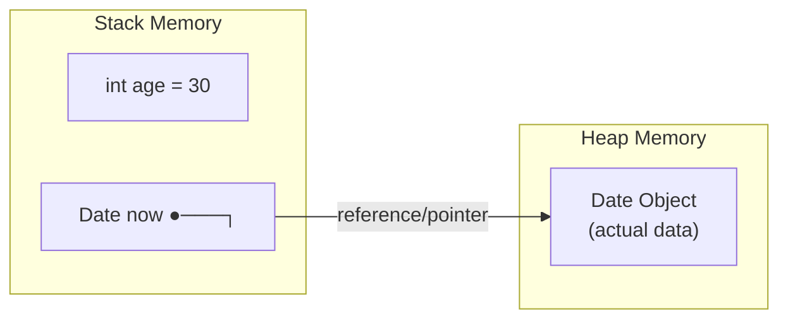
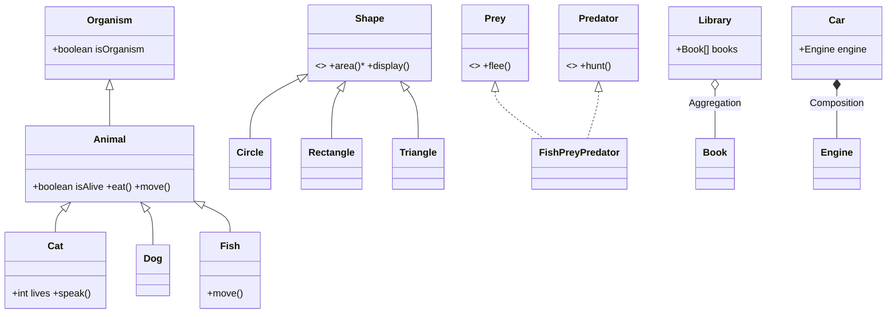
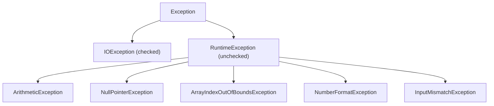
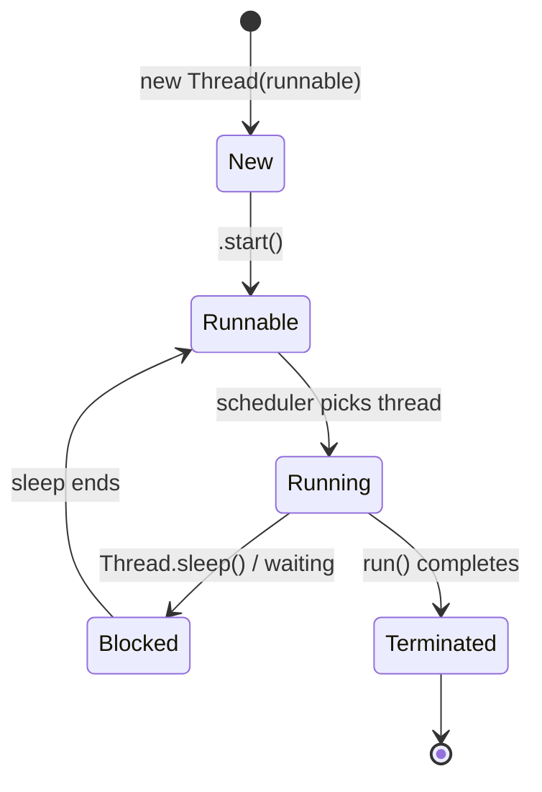
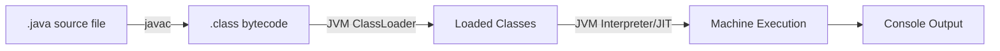
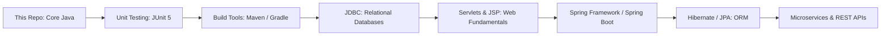

# ☕ JAVAA/Core — The Complete Java & Core Java Learning Repository

> A hands-on, topic-organized, heavily-commented Java curriculum — from `byte` to background threads — built for learning by reading real, runnable code.

[](https://openjdk.org/) 
[](https://www.jetbrains.com/idea/) 
[]() 
[]() 
[]()

---

## 📖 Table of Contents

1. [Description](#-description)
2. [Features](#-features)
3. [Technologies Used](#-technologies-used)
4. [Java Learning Roadmap](#-java-learning-roadmap)
5. [Repository Structure](#-repository-structure)
6. [Topic-wise Learning Guide](#-topic-wise-learning-guide)
7. [File-by-File Documentation](#-file-by-file-documentation)
8. [Program Index](#-program-index)
9. [Notes Summary](#-notes-summary)
10. [Concept Maps](#-concept-maps)
11. [Learning Path](#-learning-path)
12. [Best Practices](#-best-practices)
13. [Common Mistakes](#-common-mistakes)
14. [Interview Questions](#-interview-questions)
15. [Quick Revision Notes](#-quick-revision-notes)
16. [Java Cheat Sheet](#-java-cheat-sheet)
17. [Practical Learning Tips](#-practical-learning-tips)
18. [How to Run](#-how-to-run)
19. [Learning Outcomes](#-learning-outcomes)
20. [Future Learning Suggestions](#-future-learning-suggestions)
21. [Contribution Guidelines](#-contribution-guidelines)
22. [License](#-license)
23. [Final Motivation](#-final-motivation)

---

## 📌 Description

**JAVAA/Core** is a self-authored, self-paced **Java learning laboratory**. Every folder is a topic, every file is a lesson, and every lesson is a real, compilable `.java` program rather than a slide or a wall of prose.

- **Purpose** — Build a rock-solid, example-driven understanding of Java syntax and Core Java (OOP, Collections, Exceptions, Multithreading, File I/O, Generics) that mirrors how the language is actually asked about in interviews and used on the job.
- **Target audience** — Beginners taking their first steps in Java, students revising for exams/interviews, and self-taught developers who learn best by reading annotated, working code rather than theory alone.
- **Why it exists** — To create one place where a concept, its explanation, its memory model (stack vs. heap), and a runnable demonstration all live together — so revision means *reading code*, not searching scattered notes.
- **Skills you'll gain** — Java fundamentals, Object-Oriented Programming (all four pillars + relationships), the Collections Framework, exception handling, file I/O, basic concurrency, generics, and the instincts to reason about *why* Java behaves the way it does (memory, references, overriding vs. overloading, etc.).

> [!NOTE]
> This repository is a **living project**. New folders and examples are added as topics are learned — treat it as a growing course, not a finished textbook.

---

## ✨ Features

- 🗂️ **19+ topic packages** covering Basics → Control Flow → OOP → Collections → Exceptions → File I/O → Multithreading → Advanced Concepts.
- 🧵 **Every file is self-contained and runnable** — each has a `main` method or is driven by one in the same folder.
- 🧠 **In-code teaching style** — triple-slash (`///`) concept explainers, stack/heap ASCII memory diagrams, and numbered `Ex 1`, `Ex 2`, `Ex 3` variations showing how a concept evolves from naive to idiomatic.
- 🔁 **Progressive examples** — many files keep earlier attempts commented out below the active example, so you can see the *evolution* of understanding, not just the final answer.
- 📝 **Plain-text deep dives** — `.txt` notes for Collections, Maps, Sets, and Exceptions that summarize theory tables (interfaces vs. implementations, method tables).
- 🧩 **Real relationship modeling** — Aggregation (`Library`/`Book`), Composition (`Car`/`Engine`), Inheritance chains (`Organism → Animal → Cat/Dog/Fish`), and multi-interface implementation (`Fish implements Prey, Predator`).
- 🖥️ **IDE-ready** — ships with IntelliJ IDEA project files (`.idea`, `.iml`) for zero-friction setup.
- 🧪 **A dedicated `Practice/` module** — scaffolded and ready for hands-on exercises once you've studied a topic.

---

## 🛠️ Technologies Used

| Tool / Tech | Role in this Repository |
|---|---|
| **Java (JDK 17)** | Core language; syntax used (`switch` arrow-case, text blocks `"""..."""`, `var`) confirms **Java 10+** features are used throughout, verified against a locally installed **JDK 17.0.19**. |
| **IntelliJ IDEA** | Primary IDE — project ships with `Core.iml`, `Java/dev.iml`, and `.idea/` config. |
| **javac / java (CLI)** | No build tool is used — the project compiles and runs with the plain JDK toolchain. |
| **Git** | Version control; repository is a standard Git project (see `.gitignore` for IDE-file exclusion). |
| ~~Maven / Gradle~~ | **Not used.** There is no `pom.xml` or `build.gradle` — this is intentional; it keeps focus on the language, not tooling. |
| ~~JUnit~~ | **Not present yet.** Programs are verified by running `main()` and reading console output. See [Future Learning Suggestions](#-future-learning-suggestions) for where testing fits next. |

---

## 🗺️ Java Learning Roadmap

This roadmap reflects the **actual topics present in this repository**, in the order they build on one another:

```mermaid
flowchart TD
    A[Basics: Variables, Data Types, Operators, Casting, I/O] --> B[Control Statements: If-Else, Switch, Loops, Break/Continue]
    B --> C[Arrays: 1D, 2D, Searching]
    C --> D[Methods: Params, Return, Scope, Overloading, Varargs, Lambdas]
    D --> E[Strings: String Methods, StringBuilder/StringBuffer]
    E --> F[OOP Foundations: Classes & Objects, Constructors]
    F --> G[OOP Pillars: Encapsulation, Inheritance, Polymorphism, Abstraction, Interfaces]
    G --> H[OOP Relationships: Aggregation, Composition, Static Members, Anonymous Classes]
    H --> I[Collections Framework: List, Set, Map, Iterator]
    I --> J[Exception Handling: try-catch-finally, custom flow]
    J --> K[File Handling: Read, Write, Binary/Audio Streams]
    K --> L[Multithreading: Thread, Runnable, Synchronization, Daemon Threads]
    L --> M[Advanced Concepts: Generics, Math API, Date/Time API, Timer]
    M --> N[Practice Module: Applied mini-exercises]

    style A fill:#f9c74f,color:#000
    style B fill:#f9844a,color:#000
    style C fill:#f8961e,color:#000
    style D fill:#f3722c,color:#fff
    style E fill:#f94144,color:#fff
    style F fill:#90be6d,color:#000
    style G fill:#43aa8b,color:#fff
    style H fill:#4d908e,color:#fff
    style I fill:#577590,color:#fff
    style J fill:#277da1,color:#fff
    style K fill:#6a4c93,color:#fff
    style L fill:#b5179e,color:#fff
    style M fill:#7209b7,color:#fff
    style N fill:#3a0ca3,color:#fff
```



---

## 📁 Repository Structure

```text
Core/
├── README.md                          # You are here
├── Core.iml                           # IntelliJ module file (root)
└── Java/                              # The actual learning source tree
    ├── GEMINI.md                      # AI-assistant project brief (conventions & overview)
    ├── Code Completion Symbols.txt    # Legend for IntelliJ's autocomplete icons (c, m, f, v, I, e, λ, s...)
    │
    ├── Basics/                        # 🧱 Language fundamentals
    │   ├── DataTypes/                 #   Primitives vs. Reference types, stack/heap model
    │   ├── Variables/                 #   Declaration, concatenation, `final`, `var`
    │   ├── Operators/                 #   Arithmetic, assignment, comparison, logical
    │   ├── TypeCasting/                #   Implicit (widening) vs. explicit (narrowing) casts
    │   ├── WrapperClass/               #   Boxing/unboxing, parseX(), toString()
    │   ├── Enums/                      #   Fixed constant sets, constructors in enums
    │   └── InputOutput/                #   System.out, printf formatting, Scanner input
    │
    ├── ControlStatements/             # 🔀 Program flow
    │   ├── IfElse/                     #   if/else-if, nested if, ternary (incl. nested ternary)
    │   ├── Switch/                     #   Classic switch + Java 14 arrow-switch
    │   ├── Loops/                      #   for, nested for (pyramid patterns), while, do-while
    │   └── BreakContinue/              #   Loop control keywords
    │
    ├── Arrays/                        # 📦 Fixed-size collections
    │   ├── OneDimensional/             #   Declaration, indexing, user input
    │   ├── MultiDimensional/           #   2D arrays (matrices)
    │   └── Searching/                  #   Linear search over int[] and String[]
    │
    ├── Methods/                       # 🧩 Reusable code blocks
    │   ├── MethodOverloading/          #   Same name, different signatures
    │   ├── Varargs/                    #   `int... numbers` variable-arity params
    │   ├── Lambda/                     #   Functional interfaces + lambda expressions
    │   ├── Method.java, ReturnExample.java, VarScope.java
    │
    ├── Strings/                       # 🔤 Text handling
    │   ├── StringMethods/               #   length, case conversion, trim, substring, replace
    │   └── StringBuilder/               #   Mutable strings: StringBuilder vs. StringBuffer
    │
    ├── OOP/                           # 🏛️ Object-Oriented Programming (the largest topic)
    │   ├── ClassesAndObjects/          #   Blueprints, attributes, methods, toString()
    │   ├── Constructors/                #   Default & overloaded constructors
    │   ├── Encapsulation/               #   private fields + getters/setters
    │   ├── Inheritance/                 #   extends, super, multi-level (Organism→Animal→Cat)
    │   ├── Polymorphism/                #   Method overriding, abstract-typed arrays
    │   │   └── Dynamic/                 #   Runtime (dynamic) polymorphism
    │   ├── Abstraction/                 #   abstract class/method, Shape→Circle/Rectangle/Triangle
    │   ├── Interfaces/                  #   Multiple interface implementation (Prey & Predator)
    │   ├── Static/                      #   Static fields/methods shared across instances
    │   ├── AnonymousClass/              #   One-off subclassing without a named class
    │   ├── Aggregation/                 #   "Has-a" with independent lifetime (Library/Book)
    │   └── Composition/                 #   "Part-of" with owned lifetime (Car/Engine)
    │
    ├── Collections/                   # 🧺 The Java Collections Framework
    │   ├── ArrayListExamples/           #   Resizable list + List.txt notes
    │   ├── LinkedListExamples/          #   Node-based list
    │   ├── HashSetExamples/             #   HashSet, LinkedHashSet, TreeSet + set.txt notes
    │   ├── HashMapExamples/             #   HashMap, LinkedHashMap, TreeMap + map.txt notes
    │   ├── IteratorExamples/            #   Iterator protocol (hasNext/next)
    │   ├── Collection.txt               #   Framework hierarchy + interface/class overview table
    │   └── Data_Structures.txt          #   ArrayList vs HashSet vs HashMap comparison
    │
    ├── ExceptionHandling/              # 🚨 Robust error handling
    │   ├── TryCatch/                    #   try-catch-finally, try-with-resources, multi-catch
    │   └── note.txt                     #   Checked vs. unchecked exceptions reference
    │
    ├── FileHandling/                   # 💾 Persistence & streams
    │   ├── ReadingFiles/                #   BufferedReader+FileReader; binary audio (Clip/AudioSystem)
    │   └── WritingFiles/                #   FileWriter, text blocks for multi-line content
    │
    ├── Multithreading/                 # 🧵 Concurrency
    │   ├── ThreadClass/                 #   Thread creation, daemon threads
    │   ├── RunnableInterface/           #   Task-definition via Runnable
    │   └── Synchronization/             #   Multiple threads running the same Runnable
    │
    ├── AdvancedConcepts/               # 🚀 Beyond the core
    │   ├── Generics/                    #   Generic classes (Box<T>, Product<T,U>)
    │   ├── Maths/                       #   java.lang.Math utility methods
    │   ├── DateTimes/                   #   LocalDate/LocalTime/LocalDateTime/Instant, formatting
    │   └── TimerClass/                  #   Scheduled/repeating tasks with Timer + TimerTask
    │
    ├── Practice/                       # 🧪 Scaffolded workspace for applied exercises (currently empty — see GEMINI.md)
    └── out/                            # ⚙️ Compiled .class build output (generated, not source)
```

> [!TIP]
> The `out/` directory is IDE/build output — **never edit or study `.class` files**; always read the `.java` source alongside this README.

---

## 🎓 Topic-wise Learning Guide

<details>
<summary><b>🧱 Basics (Variables, Data Types, Operators, Casting)</b></summary>

- **What it is:** The atomic vocabulary of Java — how values are declared, typed, stored, and combined.
- **Why it matters:** Every later topic (methods, collections, OOP) is built from these primitives and references.
- **Real-world analogy:** Data types are like containers of different shapes/sizes (a shot glass = `byte`, a bucket = `long`); you must pick a container that fits what you're storing.
- **Internal working:** Primitives (`byte`, `short`, `int`, `long`, `float`, `double`, `boolean`, `char`) live directly on the **stack**; reference types (`String`, arrays, objects) store a **stack pointer to heap memory** — demonstrated explicitly in `DataTypes.java` and `Reference.java` with ASCII diagrams.
- **Important classes/methods:** `Integer.parseInt()`, `Double.parseDouble()`, `Character.isUpperCase()`, `Scanner.nextInt()/nextLine()`.
- **Common mistakes:** Mixing `+` for concatenation vs. addition (`"Sum: " + x + y` vs `"Sum: " + (x + y)`); forgetting the input-buffer issue after `scanner.nextInt()` before `scanner.nextLine()`.
- **Interview insight:** "Why is `int` faster than `Integer`?" → no autoboxing/unboxing overhead, no object header, stack allocation.

</details>

<details>
<summary><b>🔀 Control Statements (If-Else, Switch, Loops)</b></summary>

- **What it is:** Constructs that decide *which* code runs and *how many times*.
- **Why it matters:** Programs aren't just top-to-bottom instructions — real logic branches and repeats.
- **Real-world analogy:** A loop is a washing machine cycle (repeat until condition met); `switch` is a vending machine (pick exactly one path by key).
- **Internal working:** `for` = init → check → run → update → repeat; `while` checks *before* running (may run 0 times); `do-while` checks *after* (always runs ≥1 time) — all demonstrated side-by-side in `Loops/WhileLoop.java`.
- **Use cases:** `NestedFor.java` builds a symbol pyramid — a classic nested-loop pattern-printing exercise.
- **Common mistakes:** Forgetting `break;` in classic `switch` (fall-through bugs) — solved in this repo's examples using Java's arrow-syntax `switch` (`case "Monday" -> ...`).
- **Interview insight:** Difference between `while` and `do-while` execution guarantee; multi-label case grouping in modern switch.

</details>

<details>
<summary><b>📦 Arrays</b></summary>

- **What it is:** A fixed-size, ordered, same-type collection (a reference type).
- **Why it matters:** The stepping stone to the Collections Framework — understanding fixed-size limitations motivates why `ArrayList` exists.
- **Internal working:** `new String[size]` allocates the exact block of heap memory; `.length` reads the array's fixed size field.
- **Important methods:** `Arrays.sort()`, `Arrays.fill()`, enhanced for-each (`for (String f : fruits)`).
- **Use cases:** `SearchArray.java` implements **linear search** with a `found` boolean flag — the canonical "does X exist in this collection" pattern.
- **Common mistakes:** Off-by-one errors in `for` loop bounds against `.length`; confusing array size with number of elements filled.
- **Interview insight:** Time complexity of linear search (`O(n)`) vs. why sorted data enables binary search (`O(log n)`).

</details>

<details>
<summary><b>🧩 Methods</b></summary>

- **What it is:** Named, reusable blocks of logic — parameters in, a value (or `void`) out.
- **Why it matters:** DRY (Don't Repeat Yourself) — and the entry point to how Java's `main` method itself works.
- **Real-world analogy:** A method is a recipe: same steps, different ingredients (arguments) each time.
- **Internal working:** `VarScope.java` demonstrates that local variables shadow class (static) variables of the same name within their own method frame on the call stack.
- **Key concepts covered:** Overloading (`Overload.java` — same name `add`, different parameter counts/types), Varargs (`int... numbers`, internally packed into an array), Lambdas (`Lambda.java` — functional interfaces + `() -> ...` syntax).
- **Common mistakes:** Assuming overloaded methods differ by return type alone (they don't — signature = name + parameter list).
- **Interview insight:** "Can two methods differ only by return type?" → No, that's not overloading, it's a compile error.

</details>

<details>
<summary><b>🔤 Strings</b></summary>

- **What it is:** Java's built-in, immutable text-representing reference type, plus its mutable cousins.
- **Why it matters:** Strings are used everywhere — but their **immutability** is a top interview trap.
- **Internal working:** Every `+` concatenation or `.concat()` call creates a **new** `String` object (`StringClass.java` proves this: `str1.concat("World")` does nothing to `str1` because the result is discarded). For repeated mutation, `StringBuilder` (fast, not thread-safe) and `StringBuffer` (thread-safe, slower) reuse the same object.
- **Important methods:** `.length()`, `.substring(start, end)`, `.indexOf()`, `.trim()`, `.replace()`, `.toUpperCase()/toLowerCase()`, builder's `.append()/.insert()/.delete()/.reverse()`.
- **Performance consideration:** Building strings in a loop with `+` is `O(n²)`; using `StringBuilder.append()` in a loop is `O(n)`.
- **Interview insight:** "Why are Strings immutable?" → security (used in class loading/network params), caching via the String pool, thread-safety, and safe use as `HashMap` keys.

</details>

<details>
<summary><b>🏛️ Object-Oriented Programming (the four pillars + relationships)</b></summary>

- **What it is:** Modeling programs as interacting objects with state (fields) and behavior (methods).
- **Why it matters:** This is Core Java's centerpiece — nearly every enterprise Java codebase and interview leans on OOP fluency.
- **Real-world analogy:** A `Car` **class** is the blueprint; each `new Car()` **object** is one physical car built from it (`CarOOP.java`).

  | Pillar | What it does | Example in repo |
  |---|---|---|
  | **Encapsulation** | Hide internal state behind `private` + getters/setters | `Encapsulation/Car.java` |
  | **Inheritance** | Child reuses/extends parent's members via `extends` | `Organism → Animal → Cat/Dog/Fish` |
  | **Polymorphism** | One interface, many implementations, resolved at runtime | `Vehicle[] {Car, Bike, Boat}` looped and calling `.go()` |
  | **Abstraction** | Expose *what*, hide *how*, via `abstract` classes/interfaces | `Shape → Circle/Rectangle/Triangle` |

- **Relationships beyond the 4 pillars:**
  - **Aggregation** ("has-a", independent lifetime): `Library` holds `Book[]`, but `Book` objects are created *before* and *outside* the `Library` — they'd survive if the library were destroyed.
  - **Composition** ("part-of", owned lifetime): `Car` creates its own `Engine` internally — the `Engine` cannot exist without its `Car`.
  - **Static members:** Shared across *all* instances of a class (`Mobile.name` in `Static.java`) — changed once, visible everywhere.
  - **Anonymous classes:** One-off subclass/override with no name, common for callbacks (`TimerTask`, `Runnable`).
- **Important methods:** `super()` (call parent constructor), `@Override`, `toString()` (auto-called by `println`).
- **Common mistakes:** Confusing overriding (`@Override`, runtime, same signature, IS-A relationship) with overloading (compile-time, different signature); forgetting `@Override` and accidentally overloading instead of overriding; conflating aggregation with composition.
- **Interview insight:** "Difference between Abstraction and Interface?" → a class can extend only **one** abstract class but implement **many** interfaces (proven directly in this repo: `Fish implements Prey, Predator`).

</details>

<details>
<summary><b>🧺 Collections Framework</b></summary>

- **What it is:** A unified set of interfaces/classes (`List`, `Set`, `Map`, `Iterator`) for storing and manipulating groups of objects — the *dynamic* answer to arrays' fixed size.
- **Why it matters:** Virtually all real Java applications hold data in `ArrayList`s and `HashMap`s rather than raw arrays.
- **Internal working (from this repo's own notes):**
  - `ArrayList` = a resizable array under the hood; when full, a bigger array is allocated and the old one is copied over.
  - `LinkedList` = a chain of nodes, each holding data + a pointer to the next — fast insert/delete (`O(1)` once positioned), slower random access.
  - `HashSet`/`HashMap` = unordered, backed by hashing — fastest average lookup, no guaranteed order.
  - `LinkedHashSet`/`LinkedHashMap` = hashing **plus** a linked list to preserve insertion order.
  - `TreeSet`/`TreeMap` = red-black tree internally — always sorted by natural order.
- **Use cases:** Choose `List` for ordered/duplicate-friendly data, `Set` for uniqueness, `Map` for key→value lookups.
- **Common mistakes:** Expecting `HashMap`/`HashSet` to preserve insertion order (they don't — use the `Linked*` variants); trying to modify a `Set`/`List` by index when the interface doesn't support it.
- **Interview insight:** "HashMap vs. TreeMap vs. LinkedHashMap?" is one of the most common Java interview questions — this repo has a working example of all three side-by-side.

</details>

<details>
<summary><b>🚨 Exception Handling</b></summary>

- **What it is:** A structured mechanism (`try`/`catch`/`finally`/`throw`/`throws`) to handle runtime errors gracefully instead of crashing.
- **Why it matters:** Production code must anticipate bad input, missing files, and invalid operations.
- **Real-world analogy:** A `try` block is "attempt this risky operation"; `catch` is your emergency response plan; `finally` is "clean up regardless of outcome" (like always turning off the stove).
- **Internal working:** Checked exceptions (`IOException`) are verified at compile time and must be handled or declared; unchecked/runtime exceptions (`ArithmeticException`, `NullPointerException`) are not mandatory to catch.
- **Use cases:** `ExceptionExample.java` catches `InputMismatchException` (wrong input type), `ArithmeticException` (divide by zero), then a generic `Exception` as a safety net — plus a **try-with-resources** variant that auto-closes the `Scanner`.
- **Common mistakes:** Catching `Exception` first (it would swallow all specific exceptions below it — Java actually prevents this at compile time); forgetting that only **one** matching `catch` block runs per exception.
- **Interview insight:** "Checked vs. unchecked exceptions?" and "What always runs — even after a `return` inside `try`?" → `finally` (except on JVM crash/`System.exit()`).

</details>

<details>
<summary><b>💾 File Handling</b></summary>

- **What it is:** Reading from and writing to the filesystem.
- **Why it matters:** Nearly every real application persists or loads data from files.
- **Internal working:** `FileReader` opens a raw character stream; `BufferedReader` wraps it for efficient line-by-line reads (`readLine()` returns `null` at EOF). `FileWriter` opens/creates a file for writing; Java 15+ **text blocks** (`""" ... """`) simplify multi-line content.
- **Use cases:** `ReadFile.java` (text), `WriteFile.java` (text with text blocks), `Audio.java` (binary — reads a `.wav` via `AudioInputStream`/`Clip` with full Play/Stop/Reset/Quit controls).
- **Common mistakes:** Forgetting to close streams (solved here via **try-with-resources**, so cleanup is automatic); assuming a file exists without handling `FileNotFoundException`.
- **Interview insight:** "Why prefer try-with-resources over manual `finally` closing?" → guarantees closure even on exception, less boilerplate, works for any `AutoCloseable`.

</details>

<details>
<summary><b>🧵 Multithreading</b></summary>

- **What it is:** Running multiple sequences of instructions (threads) concurrently within one program.
- **Why it matters:** Keeps applications responsive during slow operations (I/O, timers, background work).
- **Real-world analogy:** The main thread is you cooking dinner; a background thread is the oven timer running independently while you keep chopping vegetables.
- **Internal working:** `Runnable` only **defines** work (the `run()` method); a `Thread` object is what actually **executes** it (`new Thread(myRunnable).start()`). `Thread.sleep()` pauses the *current* thread only. Daemon threads (`setDaemon(true)`) die automatically when all user threads finish — demonstrated in `ThreadingExample.java`.
- **Use cases:** `MultiThreadingExample.java` launches **two** `Thread`s off the **same** `Runnable` class (`MyRunnableSync`), showing independent, interleaved execution.
- **Common mistakes:** Calling `.run()` directly instead of `.start()` (this runs the code on the *current* thread — no new thread is created); not handling `InterruptedException` from `Thread.sleep()`.
- **Interview insight:** "Runnable vs. Thread — which is preferred?" → implementing `Runnable` is preferred (Java has single inheritance, so extending `Thread` burns your one `extends` slot).

</details>

<details>
<summary><b>🚀 Advanced Concepts (Generics, Math, Date/Time, Timer)</b></summary>

- **What it is:** Language features that make code type-safe, reusable, and time/schedule-aware.
- **Why it matters:** Generics power the entire Collections Framework; date/time and scheduling appear constantly in real applications.
- **Internal working:**
  - **Generics** — `Box<T>` uses `T` as a type placeholder filled in at use-site (`Box<Integer>`); `Product<T, U>` shows multiple type parameters.
  - **Math** — `Math.PI`, `.pow()`, `.abs()`, `.sqrt()`, `.round()`, `.max()`, `.min()` as static utility calls.
  - **Date/Time (`java.time`)** — `LocalDate`, `LocalTime`, `LocalDateTime`, `Instant` (UTC), and `DateTimeFormatter.ofPattern(...)` for custom formatting.
  - **Timer/TimerTask** — schedules a repeating task (`timer.schedule(task, delay, period)`), demonstrated via an anonymous `TimerTask` that counts down and cancels itself.
- **Common mistakes:** Forgetting generics give **compile-time** type safety only (erased at runtime — "type erasure"); confusing `LocalDateTime` (no timezone) with `Instant` (UTC instant).
- **Interview insight:** "What is type erasure?" and "Why use generics instead of `Object`?" → avoids manual casting and `ClassCastException` at runtime.

</details>

---

## 📋 File-by-File Documentation

<details>
<summary><b>Basics/</b> (click to expand)</summary>

| File | Purpose | Concepts Covered |
|---|---|---|
| `DataTypes/DataTypes.java` | Declares every primitive type and prints them | 8 primitive types, literal suffixes (`L`, `f`), underscore digit separators |
| `DataTypes/Reference.java` | Demonstrates a reference type (`Date`) | Heap allocation, `new`, constructors, reference vs. primitive |
| `Variables/Variable.java` | Declares/prints variables of each type | Declaration, string concatenation vs. numeric addition, `final`, `var` |
| `Operators/Operator.java` | Arithmetic, augmented-assignment, logical operators | `+ - * / %`, `++/--`, `&&`, `\|\|`, `!` |
| `TypeCasting/Casting.java` | Implicit vs. explicit casts | Widening (automatic), narrowing (manual `(double)`) |
| `WrapperClass/WrapperClass.java` | Wraps primitives as objects | Autoboxing/unboxing, `parseX()`, `toString()` |
| `Enums/Day.java` | Enum with constructor + field | Enum constants carrying data |
| `Enums/EnumsExample.java` | Basic + nested enum, `switch` on enum | `enum`, `Enum.valueOf()`, enhanced switch |
| `InputOutput/Print.java` | Console output patterns | `println`, `printf`, escape sequences, format flags |
| `InputOutput/UserInput.java` | Reading typed console input | `Scanner`, input buffer pitfalls |

</details>

<details>
<summary><b>ControlStatements/</b></summary>

| File | Purpose | Concepts Covered |
|---|---|---|
| `IfElse/IfElse.java` | Age-bracket branching + boolean check | `if / else if / else` |
| `IfElse/NestedIf.java` | Voting-eligibility logic | Nested `if` blocks |
| `IfElse/TernaryOperator.java` | Greeting based on time of day | Ternary `?:`, nested ternary |
| `Switch/Switch.java` | Day-of-week lookup | Classic `switch`/`break`, Java 14 arrow `switch` |
| `Loops/ForLoop.java` | User-controlled repeat count | `for` loop, `Scanner` integration |
| `Loops/NestedFor.java` | Symbol pyramid printer | Nested `for`, row/column pattern math |
| `Loops/WhileLoop.java` | Range-validated number entry | `while`, `do-while` |
| `BreakContinue/BreakContinue.java` | Skip vs. stop demonstration | `break`, `continue` |

</details>

<details>
<summary><b>Arrays/</b></summary>

| File | Purpose | Concepts Covered |
|---|---|---|
| `OneDimensional/Array.java` | Array creation, indexing, mutation | Fixed-size arrays, `Arrays.sort/fill`, enhanced for |
| `OneDimensional/UserInputArray.java` | User-populated array (scaffold) | Dynamic-sized array via user input |
| `MultiDimensional/TwoD_Array.java` | Grocery matrix | 2D array declaration/indexing, nested for-each |
| `Searching/SearchArray.java` | Find element + its index | Linear search over `int[]` and `String[]` |

</details>

<details>
<summary><b>Methods/</b></summary>

| File | Purpose | Concepts Covered |
|---|---|---|
| `Method.java` | Birthday-greeting method | Method definition & invocation |
| `ReturnExample.java` | Max-of-two-numbers | `return` values |
| `VarScope.java` | Local vs. class variable shadowing | Variable scope |
| `MethodOverloading/Overload.java` | `add()` with 2, 3, 4 params | Method overloading, signatures |
| `Varargs/VarargsExample.java` | Sum of N numbers | Varargs (`int...`) |
| `Lambda/Lambda.java` | `A obj = () -> ...` | Functional interfaces, lambda expressions |

</details>

<details>
<summary><b>Strings/</b></summary>

| File | Purpose | Concepts Covered |
|---|---|---|
| `StringMethods/StringMethods.java` | Common `String` API tour | `.length()`, `.substring()`, `.replace()`, `.trim()`, case conversion |
| `StringBuilder/StringClass.java` | Immutability proof + mutable alternatives | `String` immutability, `StringBuilder`, `StringBuffer` |

</details>

<details>
<summary><b>OOP/</b></summary>

| File | Purpose | Concepts Covered |
|---|---|---|
| `ClassesAndObjects/Car.java`, `CarOOP.java` | Blueprint + object instantiation | Class/object relationship, attribute/method access |
| `ClassesAndObjects/Car2.java`, `ArrayObject.java` | Array of objects | Object arrays, looping over objects |
| `ClassesAndObjects/CarToString.java`, `ToStringExample.java` | Meaningful object printing | `toString()` override |
| `ClassesAndObjects/Student.java`, `User.java` | Parameterized construction | Constructors, overloaded constructors |
| `Constructors/Constructor.java` | Multiple `Student` instances | Constructor initialization |
| `Constructors/OverloadedConstructors.java` | 4 ways to build a `User` | Constructor overloading |
| `Encapsulation/Car.java`, `Encapsulation.java` | Private fields + get/set | Encapsulation |
| `Inheritance/Organism.java → Animal.java → Cat/Dog/Fish.java`, `Person.java → Student/Employee.java`, `Super.java`, `Inheritance.java` | Multi-level inheritance chains | `extends`, `super()`, method inheritance & overriding |
| `Polymorphism/Vehicle.java → Car/Bike/Boat.java`, `Polymorphism.java` | Common supertype, distinct behavior | Static-typed array of abstract type, overriding |
| `Polymorphism/Dynamic/Animal.java → Cat/Dog.java`, `RuntimePolymorphism.java` | Runtime method resolution based on actual object | Dynamic (runtime) polymorphism |
| `Abstraction/Shape.java → Circle/Rectangle/Triangle.java`, `Abstraction.java` | Shared contract, per-shape area formula | `abstract` class/method, concrete inherited methods |
| `Interfaces/Prey.java`, `Predator.java` → `Rabbit/Hawk/Fish.java`, `Interface.java` | Multiple interface implementation | `interface`, multi-inheritance-like behavior |
| `Static/Static.java`, `Friend.java` | Class-shared state | `static` fields/methods |
| `AnonymousClass/Dog.java`, `AnonymousClass.java` | Inline one-off override | Anonymous classes |
| `Aggregation/Book.java`, `Library.java`, `Aggregation.java` | Independent objects assembled together | Aggregation ("has-a", independent lifetime) |
| `Composition/Engine.java`, `Car.java`, `Composition.java` | Owned sub-object | Composition ("part-of", owned lifetime) |

</details>

<details>
<summary><b>Collections/</b></summary>

| File | Purpose | Concepts Covered |
|---|---|---|
| `ArrayListExamples/ArrayListExample.java` | Dynamic list + user-driven population | `ArrayList`, `add/remove/set/get/size`, `Collections.sort()` |
| `LinkedListExamples/LinkedListExample.java` | Node-based list demo | `LinkedList`, O(1) insert/remove rationale |
| `HashMapExamples/HashMapExample.java` | Key/value storage, key uniqueness | `HashMap`, `put/get/remove/size`, `keySet()`/`values()` |
| `HashMapExamples/LinkedHashMapExample.java` | Insertion-ordered map | `LinkedHashMap` |
| `HashMapExamples/TreeMapExample.java` | Key-sorted map | `TreeMap` |
| `HashSetExamples/HashSetExample.java` | Unique, unordered elements | `HashSet`, `Set` interface reference |
| `HashSetExamples/LinkedHashSetExample.java` | Unique + insertion order | `LinkedHashSet` |
| `HashSetExamples/TreeSetExample.java` | Unique + sorted order | `TreeSet` |
| `IteratorExamples/IteratorExample.java` | Manual collection traversal | `Iterator`, `hasNext()/next()` |
| `List.txt`, `map.txt`, `set.txt`, `Collection.txt`, `Data_Structures.txt` | Theory references | Framework hierarchy, interface vs. implementation tables |

</details>

<details>
<summary><b>ExceptionHandling/ · FileHandling/ · Multithreading/ · AdvancedConcepts/</b></summary>

| File | Purpose | Concepts Covered |
|---|---|---|
| `ExceptionHandling/TryCatch/ExceptionExample.java` | Handle bad input & math errors safely | `try/catch/finally`, multi-catch, try-with-resources |
| `ExceptionHandling/note.txt` | Exception theory reference | Checked vs. unchecked, keyword glossary |
| `FileHandling/ReadingFiles/ReadFile.java` | Line-by-line text file reading | `BufferedReader` + `FileReader` |
| `FileHandling/ReadingFiles/Audio.java` | Play/stop/reset a `.wav` file | `AudioSystem`, `Clip`, `AudioInputStream` |
| `FileHandling/WritingFiles/WriteFile.java` | Write multi-line text to disk | `FileWriter`, text blocks |
| `Multithreading/ThreadClass/ThreadingExample.java` | Background countdown while main thread waits for input | `Thread`, daemon threads |
| `Multithreading/RunnableInterface/RunnableExample.java` | Task definition separate from thread | `Runnable` |
| `Multithreading/Synchronization/MultiThreadingExample.java`, `MyRunnableSync.java` | Two threads sharing one `Runnable` class | Concurrent execution, `Thread.sleep()` |
| `AdvancedConcepts/Generics/Box.java`, `Product.java`, `Generics.java` | Type-safe reusable containers | Generic classes, type parameters `<T>`, `<T,U>` |
| `AdvancedConcepts/Maths/MathsExample.java` | Common math operations | `Math.pow/abs/sqrt/round/max/min` |
| `AdvancedConcepts/DateTimes/DateTimesExample.java` | Current date/time + custom formatting | `LocalDate/Time/DateTime`, `Instant`, `DateTimeFormatter` |
| `AdvancedConcepts/TimerClass/TimerClassExample.java` | Repeating scheduled task | `Timer`, `TimerTask`, anonymous class |

</details>

---

## 📚 Program Index

A learner-facing index with objective, difficulty, and expected behavior for the flagship program in each folder.

| # | Program | Difficulty | Objective | Expected Output (summary) | Related Topics |
|---|---|:---:|---|---|---|
| 1 | `DataTypes.java` | 🟢 Beginner | Show every primitive type in use | Prints age, view count, num, price, letter, boolean | Basics |
| 2 | `Variable.java` | 🟢 Beginner | Declare & print all variable types | Prints number, float, double, char, string, boolean | Basics |
| 3 | `Operator.java` | 🟢 Beginner | Demonstrate logical NOT | Prints weather message based on `isSunny` | Basics/Operators |
| 4 | `Casting.java` | 🟢 Beginner | Divide two ints as a double | Prints `3.3333...` (implicit cast) | Basics/TypeCasting |
| 5 | `WrapperClass.java` | 🟢 Beginner | Box/unbox primitives | No console output; demonstrates syntax | Basics/WrapperClass |
| 6 | `EnumsExample.java` | 🟢 Beginner | Use a nested enum | Prints `MEDIUM` | Basics/Enums |
| 7 | `IfElse.java` | 🟢 Beginner | Boolean-based branching | Prints student status | ControlStatements |
| 8 | `TernaryOperator.java` | 🟡 Easy-Intermediate | Nested ternary greeting | Prints `Good evening.` (for time=22) | ControlStatements |
| 9 | `Switch.java` | 🟢 Beginner | Map int day → name | Prints `Thursday` | ControlStatements |
| 10 | `NestedFor.java` | 🟡 Easy-Intermediate | Print a symbol pyramid | User-defined rows/symbol pyramid | ControlStatements/Loops |
| 11 | `WhileLoop.java` | 🟡 Easy-Intermediate | Validate ranged number input | Loops until 1–10 entered | ControlStatements/Loops |
| 12 | `SearchArray.java` | 🟡 Easy-Intermediate | Linear search for user food item | Prints index found / not found | Arrays/Searching |
| 13 | `TwoD_Array.java` | 🟡 Easy-Intermediate | Modify & print a matrix | Prints groceries row by row | Arrays/MultiDimensional |
| 14 | `Overload.java` | 🟡 Easy-Intermediate | Sum via overloaded `add()` | Prints `10.0` | Methods/MethodOverloading |
| 15 | `VarargsExample.java` | 🟡 Easy-Intermediate | Sum via varargs | Prints `10` | Methods/Varargs |
| 16 | `Lambda.java` | 🟡 Easy-Intermediate | Functional interface + lambda | Prints `Hello World` | Methods/Lambda |
| 17 | `StringMethods.java` | 🟢 Beginner | Tour common `String` methods | Prints transformed strings | Strings |
| 18 | `StringClass.java` | 🟡 Easy-Intermediate | Prove String immutability | Prints unchanged `str1` | Strings/StringBuilder |
| 19 | `CarOOP.java` | 🟢 Beginner | Create & use an object | Prints attributes + drive/start/stop messages | OOP/ClassesAndObjects |
| 20 | `OverloadedConstructors.java` | 🟡 Easy-Intermediate | Build `User` 4 different ways | Prints 4 distinct user profiles | OOP/Constructors |
| 21 | `Encapsulation.java` | 🟡 Easy-Intermediate | Read/write private fields safely | Prints updated color/price | OOP/Encapsulation |
| 22 | `Inheritance.java` / `Super.java` | 🟠 Intermediate | Multi-level inheritance | Prints inherited + overridden behavior | OOP/Inheritance |
| 23 | `Polymorphism.java` | 🟠 Intermediate | One loop, three vehicle behaviors | Prints Drive/Sail/Bike messages | OOP/Polymorphism |
| 24 | `RuntimePolymorphism.java` | 🟠 Intermediate | Decide behavior at runtime by user choice | Prints Meow or Bhow Bhow | OOP/Polymorphism/Dynamic |
| 25 | `Abstraction.java` | 🟠 Intermediate | Compute area via abstract contract | Prints shape areas | OOP/Abstraction |
| 26 | `Interface.java` | 🟠 Intermediate | One class, two interfaces | Prints flee + hunt behavior | OOP/Interfaces |
| 27 | `Static.java` | 🟠 Intermediate | Shared vs. per-object state | Prints shared `name` across objects | OOP/Static |
| 28 | `Aggregation.java` | 🟠 Intermediate | Assemble independent objects | Prints library + book details | OOP/Aggregation |
| 29 | `Composition.java` | 🟠 Intermediate | Owned sub-object | Prints car + embedded engine type | OOP/Composition |
| 30 | `ArrayListExample.java` | 🟡 Easy-Intermediate | Dynamic list from user input | Prints entered foods list | Collections |
| 31 | `HashMapExample.java` | 🟠 Intermediate | Key uniqueness demo | Prints `person + age` pairs | Collections |
| 32 | `TreeMapExample.java` | 🟠 Intermediate | Sorted key-value store | Prints alphabetically sorted map | Collections |
| 33 | `IteratorExample.java` | 🟠 Intermediate | Manual traversal | Prints each car via `Iterator` | Collections |
| 34 | `ExceptionExample.java` | 🟠 Intermediate | Handle bad/absent input safely | Prints friendly error or entered number | ExceptionHandling |
| 35 | `ReadFile.java` / `WriteFile.java` | 🟠 Intermediate | Persist & retrieve text | Reads/writes to disk successfully | FileHandling |
| 36 | `Audio.java` | 🔴 Advanced | Control audio playback | Interactive Play/Stop/Reset console menu | FileHandling |
| 37 | `ThreadingExample.java` | 🔴 Advanced | Background timer + foreground input | Prints countdown while awaiting name | Multithreading |
| 38 | `MultiThreadingExample.java` | 🔴 Advanced | Two concurrent threads | Interleaved 1–5 counts from both threads | Multithreading |
| 39 | `Generics.java` | 🔴 Advanced | Type-safe generic container | Prints boxed `Integer` value | AdvancedConcepts/Generics |
| 40 | `TimerClassExample.java` | 🔴 Advanced | Scheduled repeating task | Prints "Hello" 4x then "Task Complete" | AdvancedConcepts/TimerClass |
| 41 | `DateTimesExample.java` | 🟠 Intermediate | Custom date/time formatting | Prints `dd-MM-yyyy HH:mm:ss` string | AdvancedConcepts/DateTimes |

---

## 🧾 Notes Summary

The repository's plain-text notes are synthesized (not duplicated) below:

**Collections Framework hierarchy** (`Collection.txt`)
```
Iterable → Collection → List (ArrayList, LinkedList)
                      → Set  (HashSet, TreeSet, LinkedHashSet)
                      → Queue (PriorityQueue)
Map (separate hierarchy) → HashMap, TreeMap, LinkedHashMap
```
Rule of thumb: use **List** when order + duplicates matter, **Set** for uniqueness, **Map** for key-based lookup.

**List vs. Set vs. Map** (`List.txt`, `set.txt`, `map.txt`, `Data_Structures.txt`)

| | Duplicates? | Ordered? | Index Access? | Sorted variant |
|---|:---:|:---:|:---:|:---:|
| **List** | ✅ | ✅ (insertion) | ✅ `get(i)` | — |
| **Set** | ❌ | ❌ (unless Linked/Tree) | ❌ | `TreeSet` |
| **Map** | Keys ❌ / Values ✅ | ❌ (unless Linked/Tree) | ❌ (by key) | `TreeMap` |

**Exceptions** (`ExceptionHandling/note.txt`)
- **Checked** (compile-time-enforced): `IOException`, `SQLException` — must be handled or declared with `throws`.
- **Unchecked** (runtime): `ArithmeticException`, `NullPointerException`, `ArrayIndexOutOfBoundsException`, `NumberFormatException` — handling is optional but recommended.
- Execution order is always `try → catch → finally`; only **one** matching `catch` runs; `finally` runs regardless (barring a JVM crash).

---

## 🧩 Concept Maps

### Stack vs. Heap Memory Model

Primitives store their **value** directly on the stack. Reference types store a **pointer** on the stack that points to the real object on the heap — this is why `point2 = point1` copies the *reference*, not the object (both variables then point to the same heap object).

### OOP Class Relationships in this Repository


### Exception Hierarchy (as used in this repository)


### Thread Lifecycle (as demonstrated in `Multithreading/`)


### Java Program Execution Flow


---

## 🧭 Learning Path

Recommended study order with difficulty progression:

| Stage | Topics | Difficulty |
|---|---|---|
| **1. Foundations** | Basics → Control Statements → Arrays | 🟢 Beginner |
| **2. Building Blocks** | Methods → Strings | 🟡 Easy-Intermediate |
| **3. Object-Oriented Core** | Classes/Objects → Constructors → Encapsulation → Inheritance → Polymorphism → Abstraction → Interfaces | 🟠 Intermediate |
| **4. OOP Relationships** | Static → Anonymous Classes → Aggregation → Composition | 🟠 Intermediate |
| **5. Data at Scale** | Collections Framework (List/Set/Map/Iterator) | 🟠 Intermediate |
| **6. Resilience & I/O** | Exception Handling → File Handling | 🟠 Intermediate–🔴 Advanced |
| **7. Concurrency & Beyond** | Multithreading → Generics → Date/Time → Timer | 🔴 Advanced |
| **8. Apply It** | Work through `Practice/` with your own exercises combining multiple topics | 🔴 Advanced |

> [!TIP]
> Don't skip ahead to Collections before Inheritance/Polymorphism — the Collections Framework's design (interfaces + multiple implementations) is itself a live example of polymorphism.

---

## ✅ Best Practices

Demonstrated throughout this repository:

- **Use try-with-resources** for anything `Closeable` (`Scanner`, `FileWriter`, `BufferedReader`) — see `FileHandling/` and the second `ExceptionExample.java` variant.
- **Prefer `Runnable` over extending `Thread`** to preserve your single `extends` slot for real inheritance needs.
- **Program to an interface, not an implementation** — e.g. `Set<String> cars = new HashSet<>();` instead of `HashSet<String> cars = ...`.
- **Override `toString()`** on domain objects so `println(object)` is human-readable instead of a hash code.
- **Keep fields `private` and expose behavior via getters/setters** (Encapsulation) rather than public mutable fields.
- **Favor composition over inheritance** when the relationship is "part-of" rather than "is-a" (`Car`/`Engine`).
- **Use enhanced switch (`->`) over classic switch** to eliminate fall-through bugs.
- **Use `StringBuilder` inside loops** instead of repeated `+` concatenation.

---

## ⚠️ Common Mistakes

| Mistake | Why it's wrong | Fix demonstrated in repo |
|---|---|---|
| `"Sum: " + x + y` expecting addition | `+` is left-associative; concatenates left to right | Wrap in parens: `"Sum: " + (x + y)` (`Variable.java`) |
| Calling `scanner.nextInt()` then `scanner.nextLine()` | Leaves a leftover `\n` in the input buffer, causing the next line-read to return empty | Call an extra `scanner.nextLine()` to flush the buffer (`UserInput.java`) |
| Assuming `HashMap`/`HashSet` preserve insertion order | They're hash-based with no ordering guarantee | Use `LinkedHashMap`/`LinkedHashSet` instead |
| Forgetting `break;` in a classic `switch` | Causes fall-through into the next case | Use arrow-syntax `switch` (`case X -> ...`) |
| Treating `str.concat()`/`str.replace()` as in-place mutation | `String` is immutable — methods return a **new** string | Reassign the result, or use `StringBuilder` |
| Calling `thread.run()` instead of `thread.start()` | Executes the code on the current thread synchronously — no concurrency happens | Always call `.start()` |
| Not closing file/scanner resources | Leaks file handles / can lock files | Use try-with-resources |
| Confusing Aggregation with Composition | Both are "has-a", but lifetime dependency differs | Aggregation: parts outlive the whole (`Library`/`Book`); Composition: parts die with the whole (`Car`/`Engine`) |

---

## 💬 Interview Questions

<details>
<summary><b>🟢 Beginner</b></summary>

1. What are the 8 primitive data types in Java, and their default sizes?
2. What is the difference between `==` and `.equals()` for Strings?
3. Why is a `String` immutable in Java?
4. What's the difference between `while` and `do-while` loops?
5. What does the `final` keyword do to a variable?
6. What is autoboxing and unboxing?
7. What is the difference between implicit and explicit type casting?

</details>

<details>
<summary><b>🟠 Intermediate</b></summary>

1. What is the difference between method overloading and method overriding?
2. Explain encapsulation and why fields should be `private`.
3. What is the difference between an abstract class and an interface? Can a class implement multiple interfaces but extend only one class?
4. What's the difference between `HashMap`, `LinkedHashMap`, and `TreeMap`?
5. What's the difference between `ArrayList` and `LinkedList`, and when would you choose one over the other?
6. What is the difference between Aggregation and Composition?
7. Explain checked vs. unchecked exceptions with examples.
8. What is the purpose of the `super` keyword?
9. Why does overriding `toString()` matter?

</details>

<details>
<summary><b>🔴 Advanced</b></summary>

1. Explain runtime (dynamic) polymorphism — how does the JVM decide which overridden method to call?
2. What is the difference between `Runnable` and extending `Thread`? Why is `Runnable` generally preferred?
3. What are daemon threads, and how do they differ from user threads?
4. What is type erasure in Java generics, and what limitation does it impose?
5. Why is `StringBuilder` not thread-safe while `StringBuffer` is — and what's the performance trade-off?
6. What is try-with-resources, and how does it differ from a manual `finally`-based close?
7. Why can a `HashSet` only guarantee uniqueness efficiently, but not order — describe the underlying hashing structure.
8. Walk through what happens from `javac MyFile.java` to `java MyFile` running on the JVM.

</details>

---

## ⚡ Quick Revision Notes

**Memory tricks:**
- 🥤 **PEMDAS** → Order of operations: Parenthesis, Exponent, Multiplication, Division, Addition, Subtraction.
- 🏠 **"Has-a vs. Is-a"** → Inheritance = **is-a** (`Dog` **is an** `Animal`); Aggregation/Composition = **has-a** (`Car` **has an** `Engine`).
- 🧳 **Stack = value, Heap = object** → primitives on the stack, objects on the heap, references point from stack to heap.
- 🔑 **Map = key unique, Set = value unique, List = anything goes (ordered, duplicates ok)**.
- 🚦 **try → catch → finally**, always in that order; `finally` almost always runs.

**Key facts at a glance:**

| Concept | One-liner |
|---|---|
| `==` vs `.equals()` | `==` compares references (memory address); `.equals()` compares logical content |
| Overloading vs Overriding | Overloading = compile-time, same class, different params. Overriding = runtime, subclass, same signature |
| `ArrayList` vs `LinkedList` | Array-backed (fast random access) vs. node-based (fast insert/remove) |
| `HashMap` vs `TreeMap` | Unordered/fast vs. sorted-by-key |
| Checked vs Unchecked exceptions | Compile-time enforced vs. runtime-only |
| `Runnable` vs `Thread` | Task definition vs. actual execution unit |
| Abstract class vs Interface | Single inheritance, can have state | Multiple "inheritance", historically no state |

---

## 🧮 Java Cheat Sheet

<details>
<summary><b>Primitive Types</b></summary>

| Type | Size | Range/Notes |
|---|---|---|
| `byte` | 8-bit | -128 to 127 |
| `short` | 16-bit | -32,768 to 32,767 |
| `int` | 32-bit | ±2.1 billion |
| `long` | 64-bit | Needs `L` suffix for literals |
| `float` | 32-bit | Needs `f` suffix, ~6-7 decimal digits |
| `double` | 64-bit | ~15-16 decimal digits |
| `char` | 16-bit | Single character, `'x'` |
| `boolean` | 1-bit (JVM-dependent) | `true` / `false` |

</details>

<details>
<summary><b>Operators</b></summary>

```
Arithmetic:   + - * / %
Assignment:   = += -= *= /= %=
Comparison:   == != > < >= <=
Logical:      && || !
Ternary:      condition ? valueIfTrue : valueIfFalse
```
</details>

<details>
<summary><b>Loops & Control Flow</b></summary>

```java
for (int i = 0; i < n; i++) { }
while (condition) { }
do { } while (condition);
switch (value) {
    case A -> System.out.println("A");
    default -> System.out.println("default");
}
```
</details>

<details>
<summary><b>Arrays</b></summary>

```java
int[] nums = {1, 2, 3};
String[] fruit = new String[3];
for (int n : nums) { }        // enhanced for-each
Arrays.sort(nums);
```
</details>

<details>
<summary><b>Classes, Objects, OOP</b></summary>

```java
public class Car {
    private String model;                 // Encapsulation
    Car(String model) { this.model = model; }   // Constructor
    void drive() { }                       // Method
    @Override public String toString() { return model; }
}

abstract class Shape { abstract double area(); }         // Abstraction
interface Flyable { void fly(); }                          // Interface
class Bird extends Animal implements Flyable { }            // Inheritance + Interface
```
</details>

<details>
<summary><b>Collections</b></summary>

```java
List<String> list = new ArrayList<>();
Set<String>  set  = new HashSet<>();
Map<String,String> map = new HashMap<>();

list.add("x"); list.get(0); list.remove(0); list.size();
set.add("x"); set.contains("x");
map.put("k","v"); map.get("k"); map.keySet(); map.values();
```
</details>

<details>
<summary><b>Exceptions</b></summary>

```java
try {
    riskyCode();
} catch (SpecificException e) {
    // handle
} finally {
    // always runs
}
```
</details>

<details>
<summary><b>File I/O</b></summary>

```java
try (BufferedReader r = new BufferedReader(new FileReader(path))) {
    String line;
    while ((line = r.readLine()) != null) { }
}
try (FileWriter w = new FileWriter(path)) {
    w.write("content");
}
```
</details>

<details>
<summary><b>Multithreading</b></summary>

```java
class MyTask implements Runnable {
    public void run() { }
}
Thread t = new Thread(new MyTask());
t.setDaemon(true);
t.start();
```
</details>

<details>
<summary><b>Generics</b></summary>

```java
class Box<T> {
    T item;
    void set(T item) { this.item = item; }
    T get() { return item; }
}
Box<Integer> box = new Box<>();
```
</details>

---

## 🎯 Practical Learning Tips

- **Basics/Control Flow** → Re-type every example from memory without looking, then compare.
- **OOP** → Draw the class relationship on paper *before* writing code (is it "is-a", "has-a", or "part-of"?).
- **Collections** → For every problem, ask: "Do I need order? Uniqueness? Key lookup?" — then pick List/Set/Map accordingly.
- **Exceptions** → Deliberately break your own programs (divide by zero, wrong input types) and catch the resulting exceptions.
- **Multithreading** → Add `System.out.println(Thread.currentThread().getName())` inside `run()` to *see* concurrency happen.
- **Mini-project ideas to build in `Practice/`:**
  - A **console phonebook** using `HashMap<String, String>` (name → number) with add/search/delete.
  - A **library system** extending the existing `Aggregation` example with borrow/return logic and custom exceptions for "book not found."
  - A **simple quiz game** using `enum` for difficulty levels, arrays for questions, and a scoring loop.
  - A **multi-threaded stopwatch/countdown** building on `TimerClassExample.java` and `ThreadingExample.java`.
  - A **text-file based to-do list** combining `FileHandling` (persistence) with `Collections` (in-memory list) and `ExceptionHandling` (missing file recovery).

---

## 🚀 How to Run

### Prerequisites
- **JDK 17** (or any JDK 11+ — the code uses `var`, text blocks, and arrow-`switch`, all Java 10–14+ features). Verify with:
  ```bash
  java -version
  ```
- **IntelliJ IDEA** (recommended) — the repo already includes `.idea/` and `.iml` project files for both the root and the `Java/` module.

### Option 1 — Run via IntelliJ IDEA (recommended)
1. Open the repository root in IntelliJ IDEA.
2. Navigate to any topic folder under `Java/`.
3. Right-click the `.java` file containing a `main` method → **Run**.

### Option 2 — Run a single file directly (Java 11+)
```bash
cd Java
java Basics/DataTypes/DataTypes.java
```

### Option 3 — Compile the whole tree, then run by fully-qualified class name
```bash
cd Java
find . -name "*.java" -not -path "./out/*" | xargs javac -d out

# Then run any example via its package path:
java -cp out OOP.Polymorphism.Polymorphism
java -cp out Collections.HashMapExamples.HashMapExample
java -cp out Basics.DataTypes.DataTypes
```

### Troubleshooting

| Problem | Likely Cause | Fix |
|---|---|---|
| `error: class X is public, should be declared in a file named X.java` | File name doesn't match public class name | Ensure exactly one active (uncommented) `public class` per file, matching the filename |
| `NoClassDefFoundError` | Running with wrong classpath or missing package prefix | Always run with `-cp out` and the **full package path** (dots, not slashes) |
| Multiple `main` methods "conflict" when running via CLI compile-all | Some files contain several `Ex 1 / Ex 2 / Ex 3` variants — only one is ever active (uncommented) at a time | This is intentional; comment/uncomment the variant you want to study |
| `FileNotFoundException` in `FileHandling/` examples | Hardcoded paths like `/home/usaid/TestFile.io/...` don't exist on your machine | Update the `filePath` string to a real path on your system before running |

---

## 🏁 Learning Outcomes

By working through this repository, you will be able to:

- ✅ Confidently declare, cast, and manipulate all of Java's primitive and reference types.
- ✅ Control program flow with loops, conditionals, and modern switch expressions.
- ✅ Write, overload, and reason about the scope of Java methods, including lambdas and varargs.
- ✅ Design classes using all four OOP pillars, plus Aggregation, Composition, and Static members — and correctly identify which relationship a design calls for.
- ✅ Choose the right Collections Framework structure (`List`/`Set`/`Map`, and their ordered/sorted variants) for a given problem.
- ✅ Handle errors safely using checked/unchecked exceptions, multi-catch, and try-with-resources.
- ✅ Read from and write to text and binary files, with proper resource management.
- ✅ Create and manage basic multithreaded programs, understanding daemon threads and thread safety basics.
- ✅ Use Generics, the Math API, the modern Date/Time API, and scheduled tasks (`Timer`).
- ✅ Explain and defend these concepts in a technical interview with concrete, working-code examples.

---

## 🔮 Future Learning Suggestions

Once this repository's roadmap is complete, the natural next steps are:



- **JUnit** — start writing automated tests for the logic already in `Methods/` and `OOP/` (e.g., assert `Overload.add(1,2,3,4) == 10`).
- **Maven/Gradle** — introduce a build tool once the project needs external dependencies (this repo intentionally has none yet).
- **JDBC** — the commit history shows a prior (now removed) JDBC experiment; a clean, guided reintroduction is a natural next module for database connectivity.
- **Servlets/JSP → Spring Boot** — the standard path from Core Java into enterprise/web Java development.
- **Hibernate/JPA** — object-relational mapping, once comfortable with both JDBC and Collections.

---

## 🤝 Contribution Guidelines

This is a personal learning repository, but contributions that improve its educational value are welcome:

1. **Stay topical** — place new examples inside their matching concept folder (or propose a new, clearly-named folder for a new topic).
2. **Keep the teaching style** — use `///` header comments explaining *what* and *why*, and number variations as `// Ex 1`, `// Ex 2`, etc.
3. **One idea per file** — don't mix unrelated concepts in a single example.
4. **Verify it runs** — compile and execute your example before submitting (`javac` + `java`, or IntelliJ Run).
5. **Follow naming conventions** — PascalCase for classes/files, camelCase for methods/variables, package declarations matching the folder path exactly.
6. **Update this README** — if you add a new topic folder, add a row/entry to the relevant tables above (Repository Structure, File-by-File Documentation, Program Index).

---

## 📜 License

No license file currently exists in this repository. For an educational, open-source-friendly repository like this, the **MIT License** is recommended — it's permissive, simple, and widely understood, allowing others to freely learn from, copy, and adapt these examples with attribution.

---

## 🌟 Final Motivation

Every expert Java developer once stared at their very first `System.out.println("Hello World")` with no idea what a class or a compiler even was. The difference between then and now was never talent — it was **reps**: reading code, breaking it, fixing it, and doing it again.

This repository is your rep counter. Every folder you finish is a concept you now *own*, not just recognize. Keep going, keep breaking things on purpose, and keep asking "but why does it work that way?" — that question is the whole game.

**Happy coding, and welcome to Core Java. 🚀**
